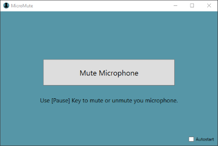
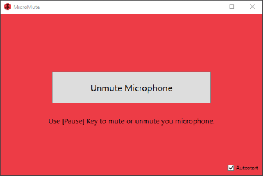

# MicroMute
## Introduction
This small tool enables you to mute your microphone with a global shortcut and to display the current status easyly.
## Requirements
* Windows 10 x64
* [.NET Core 3.1](https://dotnet.microsoft.com/download/dotnet-core/current/runtime)
  * If it is not possible to install the current .NET Core framework, you can also use the self-contained release. That release contains all required components, but the bundle-size is significantly larger.
  * If it is absolutely necessary to use the old .NET framework, then there is a branch in the repository which targets .NET 4.7.2 and can be used as starting point of your own build.
## Usage
The application starts minimized and is displayed in the tray.  
  
With a double click on the tray icon the application can be opened in window mode.  
  
All your microphones are muted with the `Pause`-key, alternatively the mute/unmute button can also be used.  

### Autostart
By setting the autostart checkbox, you can run the application automatically after a restart from the current location.